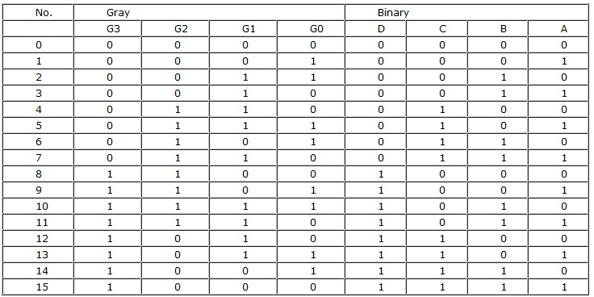
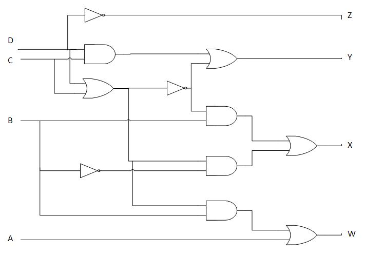

### Counters
#### Binary Codes:
A symbolic representation of data/ information is called code. The base or radix of the binary number is 2. Hence, it has two independent symbols. The symbols used are 0 and 1. A binary digit is called as a bit. A binary number consists of sequence of bits, each of which is either a 0 or 1. Each bit carries a weight based on its position relative to the binary point. The weight of each bit position is one power of 2 greater than the weight of the position to its immediate right. e. g. of binary number is 100011 which is equivalent to decimal number 35.

#### BCD Codes:
Numeric codes represent numeric information i.e. only numbers as a series of 0’s and 1’s. Numeric codes used to represent decimal digits are called Binary Coded Decimal (BCD) codes. A BCD code is one, in which the digits of a decimal number are encoded-one at a time into group of four binary digits. There are a large number of BCD codes in order to represent decimal digits0, 1, 2,……9, it is necessary to use a sequence of at least four binary digits. Such a sequence of binary digits which represents a decimal digit is called code word.

#### Gray Codes:

It is a non-weighted code; therefore, it is not a suitable for arithmetic operations. It is a cyclic code because successive code words in this code differ in one bit position only i.e. it is a unit distance code.

**Applications of Gray Code:**
* In instrumentation and data acquisition system where linear or angular displacement is measured.
* In shaft encoders, input-output devices, A/D converters and the other peripheral equipment.

#### Excess-3 code:
It is a non-weighted code. It is also a self-complementing BCD code used in decimal arithmetic units. . The Excess-3 code for the decimal number is performed in the same manner as BCD except that decimal number 3 is added to the each decimal unit before encoding it to binary.

 
#### Code Converters:
 
The availability of a large variety of codes for the same discrete elements of information results in the use of different codes by different digital systems. It is some time necessary to use the output of one system as the input to the other. The conversion circuit must be inserted between the two systems if each uses different codes for the same information. Thus a code converter is a circuit that makes the two systems compatible even though each uses the different code.

#### Binary to gray code:
* **truth table:**

#### Binary to Gray:

* **Equations:**

* **Diagram: Logic diagram for Binary to Gray Convertor is given below:**

#### Gray to Binary:

* **Equations:**

* **Diagram:**

#### BCD to Excess-3: 

To convert from binary code A to binary code B, the input lines must supply the bit combination of elements as specified by code A and the output lines must generate the corresponding bit combination of code B. A combinational circuit performs this transformation by means of logic gates. As we want to design 4-bit code, we must use four input variables and four output variables. Designate the four input binary variables by the symbols A,B,C,D, and the four output variables by w, x, y, and z. The truth table relating the input and output variables is as shown. A two-level logic diagram may be obtained directly from the Boolean expressions derived by the maps. The expressions obtained may be manipulated for the purpose of using common gates for two or more outputs. This manipulation illustrates flexibility obtained with multiple-output systems when implemented with three or more levels of gates.

* **Equations:**

z = D
y = CD+C’D’=CD(C+D)’
x = B’C+B’D+BC’D’= B’(C+D) +BC’D’
x = B’(C+D) +B(C+D)’
w = A+BC+BD=A+B(C+D)

* **Diagram:**
Logic Diagram for BCD to Excess-3 Code Converter:

